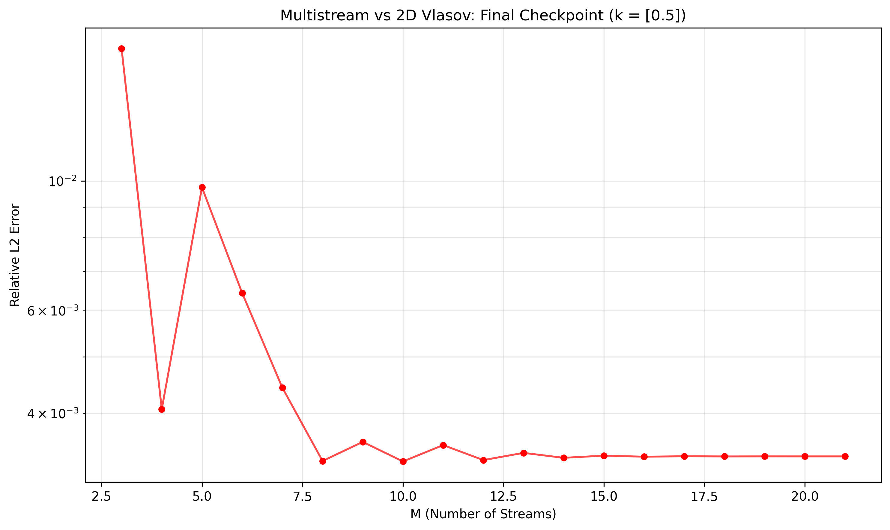

# A Firedrake-Based Finite Element Approach to the Vlasov-Poisson Problem

## The Question Asked

Plasma is the fourth state of matter, and it behaves the way it does because charged particles interact with each other over long distances, not just when they collide. To describe that properly, you need a kinetic picture: not just the density and temperature of the plasma, but the full distribution of particles across position and velocity, at every point in space, at every moment in time.

That picture lives in up to seven dimensions. Three for position, three for velocity, one for time. Simulating it directly is close to impossible for anything resembling a real reactor geometry. So the real question this project asks is: how much can you simplify that picture, and still trust what it tells you?

## The Formulation

The main problem is the Vlasov equation. It describes how a distribution of particles moves through phase space, carried along by their own velocity and pushed by whatever force acts on them.

The coupling is Poisson's equation. Plasma is self-consistent: the particles create the electric field, and that field pushes the particles right back. So the charge density from the Vlasov side feeds into Poisson's equation for the electric potential, and the resulting field feeds back into the Vlasov equation. Neither equation stands alone.

To make this tractable to study closely, the work reduces the problem to one spatial dimension and one velocity dimension, keeping the coupling intact while making the numerics manageable enough to validate carefully.

## The Approach

Rather than resolving the full velocity space on a grid, the idea is to represent it with a small number of streams. Each stream carries its own charge density and its own velocity, and moves through physical space according to its own pair of evolution equations. Instead of one distribution smeared across all possible velocities, you get a handful of moving slices, each one tracking a piece of the whole.

Physical space is discretised with finite elements, built in [Firedrake](https://firedrakeproject.org). The streams are set up initially using Gauss-Hermite quadrature, since the starting distribution is Gaussian in velocity. Charge densities are allowed to jump between mesh cells, so they use discontinuous elements. The electric potential and the stream velocities need to stay smooth, so they use continuous elements. The whole system is advanced in time with a third-order Runge-Kutta scheme built for stability.

To know whether any of this can be trusted, the multistream solution is checked against a direct finite element solve of the full 2D Vlasov-Poisson system, the expensive version this method is trying to avoid.

## The Result

At the very start, before any time evolution, the multistream method reproduces the exact moment to machine precision once you use three or more streams. That is not a coincidence: it falls directly out of the quadrature rule being exact for polynomials up to a known degree, and it is a strong first check that the method is doing what it claims.

As the system evolves in time, and the multistream result is compared against the full 2D solve:

*Relative error between the multistream and 2D Vlasov moments, at the final checkpoint, as the number of streams increases (k = 0.5). The error drops fast at first, then flattens once the streams are enough to resolve the velocity distribution.*

Good accuracy shows up by three or four streams, long before the method needs anywhere near the resolution the full 2D solve requires. That gap is the entire point: it is where the computational saving lives.

## Continuing the Work

The method holds up well for short to moderate simulation times. Past a certain point in time, the error stops decreasing smoothly and starts behaving unpredictably. That is not a dead end, it is the next problem to solve, and it is a genuine, open question rather than a rough edge to smooth over later.

This work is ongoing. Next steps include looking beyond the single moment studied here, testing across a wider range of physical parameters, and eventually building toward the full two and three dimensional case, which is where this method would actually need to prove itself for reactor scale problems.

## Built With

Python, [Firedrake](https://firedrakeproject.org) for the finite element discretisation, PETSc for the underlying linear solvers, and SciPy for the Gauss-Hermite quadrature.

## Repository Map

- `run_simulations.py` : **main entry point**. Sweeps M and T values, runs both the multistream and 2D Vlasov solvers, and produces the checkpoint data behind every plot in this repo
- `params.py`, `config.py` : simulation parameters (wavenumber, amplitude, domain size, mesh resolution)
- `multistream_clean.py` : the 1D multistream solver
- `vp1d.py` : the reference 2D Vlasov-Poisson solver
- `analysis_clean.py` : entry point for running the comparative analysis
- `analysis/` : moment calculation, cross-mesh interpolation, error analysis, and plotting
  - `moment_calculator.py`, `moment_transfer.py`, `error_analysis.py`, `data_loader.py`, `convergence_study.py`, `plotting.py`
- `plots/` : generated convergence and error figures
- `project_presentation-3.pdf` : project presentation slides

## Background

This was an MSc research project at Imperial College London, supervised by Prof. Colin Cotter. The full thesis, with the complete derivation, numerical framework, and results, is available on [SSRN](https://papers.ssrn.com/sol3/papers.cfm?abstract_id=5930319), and listed on [Google Scholar](https://scholar.google.com/scholar?as_q=sania+singh+firedrake&hl=en&as_sdt=0%2C5&scisbd=0).
