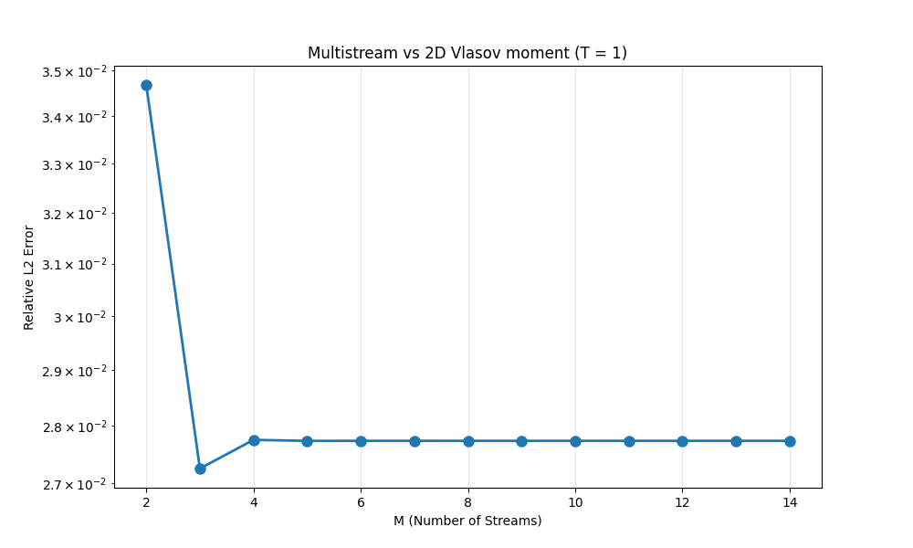

# A Firedrake-Based Finite Element Approach to the Vlasov-Poisson Problem

## The Question

Plasma is often called the fourth state of matter. Unlike ordinary gases, its charged particles interact through long-range electromagnetic forces, so the evolution of every particle depends on the collective behaviour of the entire system.

Capturing this requires a **kinetic** description. Instead of tracking only bulk quantities such as density or temperature, kinetic models describe the full particle distribution across both physical space and velocity space.

For a three-dimensional plasma, that distribution depends on three spatial coordinates, three velocity coordinates, and time. Directly resolving this seven-dimensional phase space quickly becomes computationally prohibitive, even on modern supercomputers.

This project asks a simple question:

> **How much can the kinetic description be simplified while still accurately reproducing the underlying plasma dynamics?**

---

## Mathematical Model

The governing equations are the **Vlasov-Poisson system**.

The Vlasov equation describes the evolution of the particle distribution function in phase space. Poisson's equation computes the electrostatic potential generated by that distribution.

These equations are coupled.

The particle distribution determines the charge density, the charge density determines the electric field through Poisson's equation, and that electric field in turn accelerates the particles in the Vlasov equation. The plasma therefore evolves self-consistently.

To study the numerical method in detail, this work considers the one-dimensional in space, one-dimensional in velocity (1D1V) Vlasov-Poisson problem. Although reduced in dimension, it retains the essential nonlinear coupling while remaining computationally tractable for careful validation.

---

## Numerical Method

The central idea is the **multistream formulation**.

Rather than discretising the entire velocity space, the velocity distribution is approximated by a finite number of discrete streams. Each stream carries its own charge density and velocity and evolves according to its own system of transport equations.

Physical space is discretised using the finite element method within **Firedrake**.

The initial Gaussian velocity distribution is represented using **Gauss-Hermite quadrature**, providing high-order accuracy while requiring only a small number of streams.

Different finite element spaces are chosen according to the mathematical properties of each variable:

- discontinuous Galerkin elements for stream densities, allowing discontinuities between cells;
- continuous finite elements for the electrostatic potential;
- continuous finite elements for stream velocities.

Time integration is performed using a third-order strong stability preserving Runge-Kutta (SSP-RK3) scheme.

To assess the accuracy of the reduced model, the multistream formulation is compared against a direct finite element solution of the full 2D phase-space Vlasov-Poisson system.

---

## Results

Before time evolution begins, the multistream approximation reproduces the exact first velocity moment to machine precision using three or more streams. This follows directly from the exactness properties of Gauss-Hermite quadrature and provides an important verification of the formulation.

As the solution evolves, the multistream approximation remains in close agreement with the reference 2D finite element solution.



_Relative error between the multistream and full 2D finite element solutions at **T = 1** with **k = 0.5**. The error decreases rapidly as the number of streams increases before reaching a plateau once the velocity distribution is sufficiently resolved._

Good agreement is obtained using only three or four streams, significantly reducing the computational cost compared with resolving the full velocity space directly. This reduction in degrees of freedom is the principal advantage of the multistream approach.

---

## Ongoing Work

The method performs well for short and moderate simulation times. At longer times, however, the convergence behaviour becomes less regular, indicating that additional numerical effects begin to dominate.

Current work focuses on understanding these long-time errors, extending the validation beyond the first velocity moment, investigating a wider range of physical parameters, and ultimately generalising the formulation to higher-dimensional Vlasov-Poisson systems.

---

## Software

- Python
- Firedrake
- PETSc
- NumPy
- SciPy
- Matplotlib

---

## Setup

Tested with Firedrake 2025.4.0.post0, PETSc 3.23.0, Python 3.13.3 (NumPy 2.2.6, SciPy 1.15.3, Matplotlib 3.10.3) on macOS (Apple Silicon via Homebrew).

Firedrake provides a configuration tool that prints the required system packages and environment variables for your platform.

```bash
brew install $(firedrake-configure --show-system-packages)
export $(firedrake-configure --show-env)
pip install firedrake
```

To reproduce the numerical results:

```bash
cd pipeline
python run_simulations.py
cd analysis
python convergence_study.py
```

Raw checkpoint data (`.h5`, `.vtu`) is not stored in this repository and is regenerated by the commands above.

---

## Repository Structure

- `pipeline/` — the working pipeline:
  - `run_simulations.py` — main entry point. Runs parameter sweeps, executes both the multistream and reference Vlasov-Poisson solvers, and generates checkpoint data.
  - `params.py` — simulation parameters.
  - `multistream_clean.py` — multistream solver.
  - `vp1d.py` — reference 2D Vlasov-Poisson solver.
  - `analysis/` — convergence and error analysis pipeline.
- `plots/` — generated figures.
- `01_learning/` — Firedrake tutorial examples completed during project development.
- `02_prototypes/` — early prototype implementations.
- `03_first_validation/` — archived validation scripts retained for reference.
- `docs/` — everything explaining the work:
  - `architecture.md` — code architecture and design decisions.
  - `pipeline.md` — execution workflow.
  - `project_presentation-3.pdf` — presentation slides.
  - `research_log/` — a working notebook kept during the project.

---

## Background

This repository accompanies my MSc research project in Applied Mathematics and Scientific Computing at **Imperial College London**, supervised by **Prof. Colin Cotter**.

The complete mathematical derivation, finite element formulation, numerical experiments, and validation studies are available in the accompanying paper:

- **SSRN:** https://papers.ssrn.com/sol3/papers.cfm?abstract_id=5930319
- **Google Scholar:** https://scholar.google.com/schhp?hl=en&authuser=3

## How to Cite

Sania Singh, *A Firedrake-Based Finite Element Approach to the Vlasov-Poisson Problem*, MSc thesis, Imperial College London, 2025. Supervised by Prof. Colin Cotter. Available on [SSRN](https://papers.ssrn.com/sol3/papers.cfm?abstract_id=5930319).
