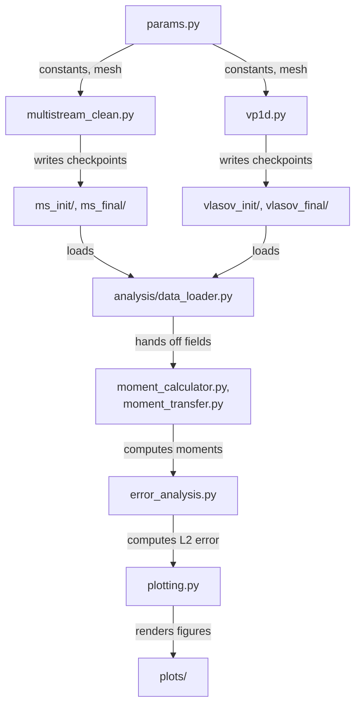

# Architecture

What each part of this codebase is, and how the pieces relate. See `pipeline.md` for the execution order.

## Overview

Two independent numerical solvers, a multistream approximation and a direct 2D reference solve, are validated against each other through a shared moment-comparison layer. The comparison is what tells us whether the cheaper multistream method can be trusted.

`run_simulations.py` sits above the two solvers and orchestrates both. Everything below the checkpoints is the comparison layer, and only runs once both solvers have produced data.

## Core parameters

`params.py` holds every physical and numerical constant (wavenumber `k`, amplitude `A`, velocity domain height `H`, spatial length `L`, final time `T`, cell counts) and the two mesh factory methods, `make_1d_mesh()` and `make_2d_mesh()`. Every solver imports from here. It is the single source of truth.

## Multistream solver (`multistream_clean.py`)

Represents the velocity distribution as `M` discrete streams instead of resolving velocity space on a grid. Each stream is a pair of fields:

- charge density `q_i`, discontinuous Galerkin (DG1)
- velocity `u_i`, continuous Galerkin (CG1, vector-valued)

Streams are initialized with Gauss-Hermite quadrature, matched to the Maxwellian starting distribution. Each RK3 stage runs three coupled solves: Poisson (CG1, with a nullspace correction for the periodic boundary), advection (DG1, upwind flux), and velocity (CG1, driven by `-∇φ`).

## 2D reference solver (`vp1d.py`)

Solves the full Vlasov equation directly, no stream approximation, on an extruded mesh (a 1D periodic base mesh extended in the velocity direction). Distribution function on DQ1, potential on CG1 and held constant in velocity. This is the ground truth the multistream method is checked against.

## Design Decisions

We use discontinuous Galerkin (DG) elements for the charge density `q_i`. Advection is hyperbolic in character, and DG allows discontinuities between cells, which naturally handles the directional nature of information flow. Upwinding then resolves the flux at each interface by taking the value from the upstream side.

We use continuous Galerkin (CG) elements for the potential `phi` and the stream velocities `u_i`. The Poisson equation is elliptic, and CG is the standard choice for elliptic problems since it needs continuity across elements for second derivatives to make sense. The velocity equation, since particle mass is normalized to unity, reduces to a straightforward mass matrix problem in time, so CG is sufficient there too.

Periodic boundary conditions give the Poisson problem a nullspace, since adding any constant to `phi` still satisfies the equation. We remove this nullspace directly using Firedrake's `VectorSpaceBasis(constant=True)`, and solve with GMRES at tight tolerance, so the electric field driving the particle motion stays accurate.

We initialize the streams with Gauss-Hermite quadrature rather than an arbitrary discretization of velocity space, since the starting distribution is Maxwellian and this quadrature is exact for polynomials up to degree `2M-1`. This is why the multistream method already matches the exact moment before any time evolution even begins.

Time stepping uses SSPRK3 throughout, for both solvers. It is well suited to hyperbolic, advection-dominated problems, since it preserves the stability properties of the underlying spatial discretization at each of its three stages.

## Orchestration (`run_simulations.py`)

Sweeps combinations of `M` and `T`, calling both solvers for each combination, producing checkpoint files. This is the file that actually generates the data behind every result in this project.

## Data layer

Firedrake `CheckpointFile` (`.h5`) format.

- Multistream: `ms_init/`, `ms_final/`, keyed by stream index
- 2D reference: `vlasov_init/`, `vlasov_final/`

VTK files (`.pvd` / `.vtu`) are written alongside for visualization in ParaView. None of this data is committed to git, it's regenerated by `run_simulations.py`.

## Analysis layer (`analysis/`)

Five single-responsibility modules, wired together by `convergence_study.py`:

- `data_loader.py` reads checkpoints
- `moment_calculator.py` computes a chosen velocity moment (currently weighted by `v²`) from either representation
- `moment_transfer.py` immerses the 1D mesh into the 2D phase space and interpolates the 2D moment onto it, so both methods can be compared on identical geometry
- `error_analysis.py` computes relative L2 error
- `plotting.py` renders error-vs-M and error-vs-T figures

## Legacy layer

`analysis_clean.py` was the first validation script, using a `v⁴` weight and an older checkpoint layout under `results/`. It is currently broken (it imports `multistream_func`, a module later renamed to `multistream_clean`). Kept as a historical record of the first validation attempt, not part of the current working pipeline.

## Early prototypes (`archive/old-codes/`)

- `DG_advection_1d.py`: a single scalar field advection plus Poisson solve, the first working piece
- `DG_advection_i>1.py`: the first attempt at multiple streams, still has an unresolved variable-shadowing bug
- `1d1v_single_stream.py`: a full single-stream Vlasov-Poisson solver, the direct precursor to the general `M`-stream method

## Learning material

Official Firedrake tutorial demos (DG advection, Helmholtz), worked through before original development began, to learn the finite element framework.

## Scope and Limitations

Quoted and closely paraphrased from the thesis itself (`Singh_Sania_Thesis.pdf`), Chapter 1 and Section 5.5.

On the collision term: "In this work, we deliberately neglect the collision term C[f] to focus exclusively on the computational challenges posed by the transport terms in the Vlasov equation. By establishing a robust numerical framework for the collisionless case first, we can validate our multistream approach against exact analytical solutions. Once the transport physics is well-captured, the framework can be naturally extended to include collision operators."

On where the method breaks down: "The method maintains stable behaviour for short to moderate time scales but encounters numerical challenges for extended simulations beyond t > 1." Testing M = 3, 6, and 9 showed "oscillatory behaviour... for t > 1," and the same pattern across all three stream counts "suggests this is a fundamental limitation rather than a convergence issue, highlighting an important constraint for practical applications requiring extended time evolution."

On where it works well: convergence is fast, with "optimal performance typically achieved at M=3-4 streams across multiple time points."

Future work, as stated in Section 5.5:

- Vary the weight function `w(v)` beyond the second moment used here, to study higher-order moments and a broader range of plasma diagnostics.
- Systematically vary the physical parameters, amplitude `A`, wavenumber `k`, and domain size `H`, to map the method's performance envelope.
- Add the collision term back onto the right-hand side of the Vlasov equation, work already underway using tensor-based approaches.
- Extend to the full 2D-2D and 3D-3D cases, acknowledged as requiring "substantial computational power."
